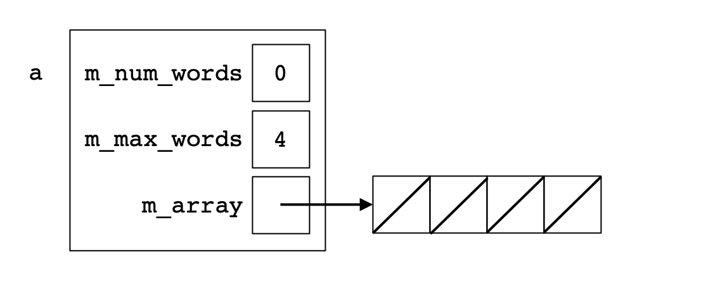
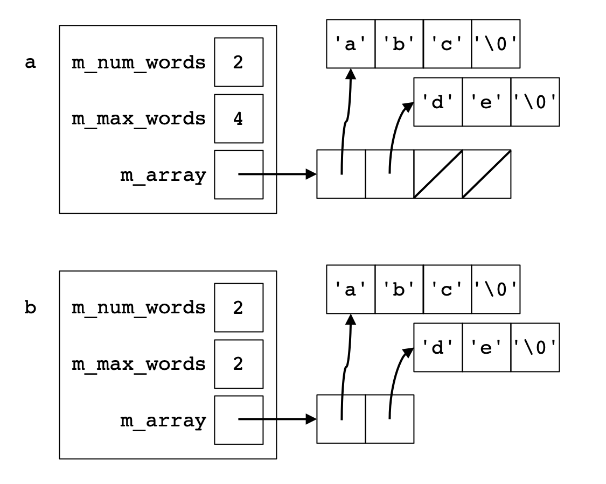
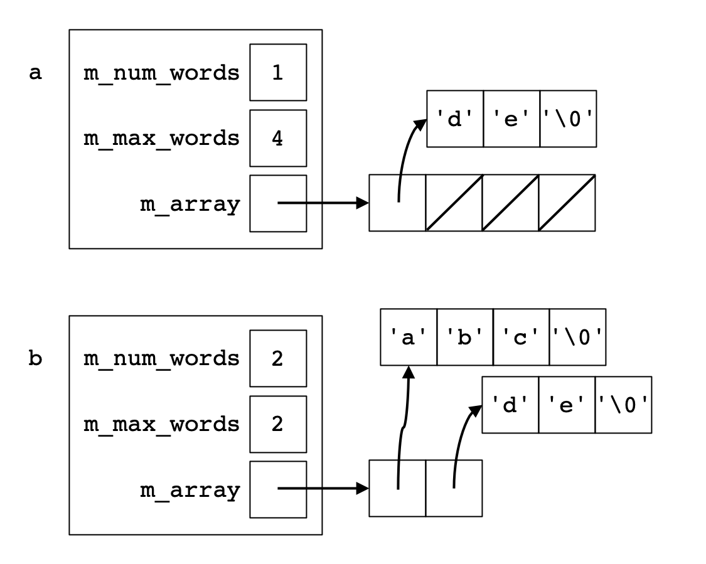

# Assignment: Word Array

## Overview

In this assignment you will implement a data structure that stores a
collection of words as a dynamically allocated array of
dynamically allocated C-strings, along with some operations on these
arrays.

A word array has both a maximum number of words it can hold (the total
size of the array) and current number of words (the number of elements
in the array that are being used to hold words). The words are stored
contiguously at the beginning of the array (that is, they are not
separated by blank entries) and unused entries are set to null.

You may use any functions from the &lt;cstring&gt; header (that are not part of other requirements, e.g. do not use strdup/strndup).

The wordarray_main.cpp program provides a text interface for
manipulating word arrays through commands. A command reference
is given below.

Starting from the provided repository, which includes starter code,
reference implementations, and test cases, complete the code in C++.

Remember to to fill out the ABOUT.txt (and LLM.txt if needed).

Implementation notes:
* It is okay to dynamically allocate and deallocate an array of 0 size.  This may simplify your implementation.
* You can use `strtok` to find words in a C-string; however, it has to be a non-const C-string since `strtok` may change it.
* For this assignment, words in a C-string are separated by any number of spaces.
* There is some code in WordArray to prevent the compiler from automatically generating copy member functions.

Requirements:
* **You must not use C++ string objects.**
* **You must not use any fixed-size (i.e. static) arrays, only dynamic arrays.**
* **You must manually manage the memory of the array and C-strings using the new/new[]/delete/delete[] operators.**
 * **You must not use other memory management functions such as malloc/free/strdup/strndup/etc...**
 * **You must not use smart pointers.**
* **You must not modify any source files other than WordArray.cpp, or include additional headers.**
* **Modifiable files:** You can edit `WordArray.cpp`.

As an example, here is what the data structures would look like after
running each of these commands in sequence:

`a new-size 4`

`b new-string abc de`

`a append b`

`a removeAll abc`

## Command reference

Commands operate on named word arrays. Note that the string [string]
may contain spaces.

*[name] new-size [maxsize]*  
&nbsp; Allocate and construct the word array `[name]` with max size `[maxsize]`.

*[name] new-string [string]*  
&nbsp; Allocate and construct the word array `[name]` with the C-string `[string]`.

*[name] delete*  
&nbsp; Destruct and deallocate the word array `[name]`.

*[name] meta*  
&nbsp; Print meta-information about the data structure in the word array `[name]`.

*[name] print*  
&nbsp; Print the word array `[name]`.

*[name] findFirst [word]*  
&nbsp; Find the first occurence of `[word]` (if any) in the word array `[name]`.

*[name] removeAll [word]*  
&nbsp; Remove all occurences of `[word]` from the word array `[name]`.

*[name] append [name2]*  
&nbsp; Append all words from the word array `[name2]` onto the word array `[name]`.
